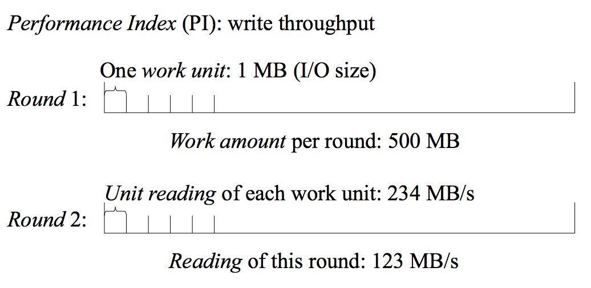

=====
Terms
=====

   A sample write workload to illustrate the terms. This workload
   consists of two rounds. Each round has a work amount of 500 MB.

We define the following terms.

* **Performance index (PI)** is one property we want to measure. For
  instance, the throughput of a storage device is a PI, and its
  latency is another PI.

.. note ::

   When multiple PIs are involved, Pilot applies the analytical
   methods you choose to each PI and combines the results. For
   instance, when calculating the work amount for next round of
   benchmark, Pilot calculates the desired work amount for each PI and
   the largest one would be picked.

* **Session** is the context for doing one measurement. We can measure
  multiple PIs in one session. One session can include multiple
  **rounds** of benchmarks, and each round can have a different
  length.

* **Work amount** is the amount of work involved in one round of
  benchmark. The work amount is related to the length of the
  workload. For instance, in a sequential write I/O workload round, we
  write 500 MB data using 1 MB writes, the work amount of this round
  is 500.

* **Work unit** is a smallest unit of work amount that we can get a
  measurement from. Using the above sample, if the I/O size is 1 MB,
  we can measure the time of each I/O syscall and calculate the
  throughput of each I/O operation. Here the work unit is 1 MB, and
  we have 500 work units in that workload round. Not all workloads
  should be divided into units. Pilot expects the work unit to be
  reasonably homogeneous. So, for instance, reading one 1 MB from
  different locations of a device can be thought as homogeneous
  because the difference in performance is small and mostly normally
  distributed. But shifting from sequential I/O to random is not
  homogeneous because that would result in huge difference in I/O
  performance. In general, the user should only divide the workload
  into units when one \emph{expects} them to have similar
  performance. If not the user should not use the work unit-related
  analytical methods of Pilot and should stick with readings (see next
  term) only. We leave heterogeneous work units as a future work.

* **Reading** is a measurement of a PI of a round. Each benchmark
  round generates one reading for each PI at the end of the round. In
  the sample above, when PI is the throughput of the device, we can
  get one throughput reading for each round.

* **Unit reading (UR)** is a measurement of a PI of a work unit. In
  the sample above, we would have 500 throughput Unit readings for
  Round 1 because it contains 500 work units, and these 500 unit
  readings would be the throughput of each 1 MB I/O operation.

* **Work-per-second (WPS)** is the calculated speed at which the
  workload consumes work. This is usually the desired PI for many
  simple workloads.

Some workload cannot be meaningfully separated into homogeneous work
units, such as booting up a system and randomly reading files of
different sizes. We get only readings from this kind of workloads.
