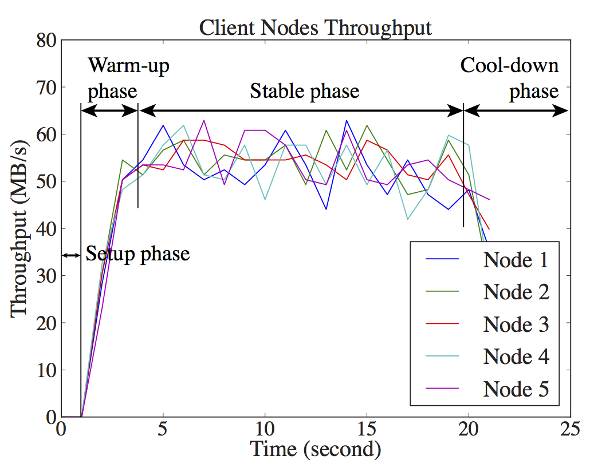
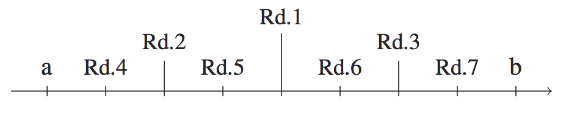

=====================================
Warm-up and Cool-Down Phase Detection
=====================================

Performance results are often used to predict the run time of future
workloads, and it is a common practice to use one number to express
the performance of a PI. For example, people usually say "the write
throughput of this device is *X*". Using only one number assumes that
the device's performance follows a linear model. Linear models
(:math:`\textit{work amount} = \textit{duration} \times
\textit{speed}`) are simple, but using only one number can only state
the device's stable performance and is not adequate when the
performance of the PI can be significantly affected by a long warm-up
or cool-down phase.

.. _fig:surge-write:

   Throughput of a multi-node random read write workload. It shows the
   setup phase, the warm-up phase caused by caching effect, and the
   cool-down phase caused by shutting down of I/O threads.

Most computer devices require a setup or warm-up phase before its
performance can reach a stable level, like shown in
:numref:`fig:surge-write`. If not properly accounted for, these
warm-up phases can have a negative impact on the precision of the
measurement. A common practice is to run the workload for a long time
and hope the effect of the warm-up phase can be amortized.  However,
when the duration of the warm-up phase is not known, there is no way
to know the actual impact on the precision. We describe two methods to
address different kinds of workloads.

We consider the following phases of a workload:

* The setup phase, including the steps that do not consume work
  amount, such as allocating memory, initializing variables, and
  opening files, etc.
* The warm-up phase when the system starts to perform work but has not
  yet reached stable performance.
* The stable phase where the work amount is being consumed at a stable
  rate.
* The cool-down phase when the system's performance starts to drop
  before finishing all the work (this is usually observed in
  multi-threaded workloads when some but not all threads finish the
  allocated work and the number of active threads starts to drop at
  the end of the workload).

We call them collectively the non-stable phases. When the workload has
multiple rounds, each round may or may not have its own non-stable
phases, and when they have, the duration can be different.  We
consider two cases, the first is when the benchmark can provide unit
readings, the second is for workloads that cannot provide unit
readings.

---------------------------------------
Workloads that can provide unit reading
---------------------------------------

If the benchmark workload can provide unit readings, which is the
measurement of each work unit, we can calculate the shift in UR mean
and use these change-points to separate the URs into phases. Multiple
change-point detection is a challenging research question, especially
when we cannot make any assumption about the distribution of the error
or the underlying process. The method we use also has to be fast to
calculate and should support online update.

After evaluating many change-point detection methods, we found that
the E-Divisive with Medians (EDM) [james:stat.ME14]_, which is a new
method published by \citeauthor{matteson:amstat14} in 2014, best fits
our requirements. EDM is non-parametric (works on mean and variance)
and robust (performs well for data drawn from a wide range of
distributions, especially non-normal distributions). EDM's initial
calculation is :math:`O(n \log n)` and can do update in :math:`O(\log
n)` time.

EDM outputs a list of all the change-points in the time series. It is
common to see many change-points at the start and end of the
workload. These change-points divide the test data into multiple
segments. Pilot uses a heuristic method to determine which segment is
the stable segment: it has to be the longest segment and also dominate
the test data (containing more than 50% of the samples). This method
can effectively remove any number of non-stable phases at the
beginning and the end.

.. TODO: a graph showing the change-points detected by EDM and how we
   pick the dominant segment.

.. _sec_wps_method:

------------------------------------------
Workloads that cannot provide unit reading
------------------------------------------

Some workload cannot be meaningfully separated into units, or requires
costly changes to the source code for providing work unit-level
information, or is certified and cannot be modified.  In these cases,
we designed the following Work-per-second (WPS) Linear Regression
Method to detect and remove the non-stable phases from the results of
these workloads. A linear regression model works best when:

* The work amount of the workload is adjustable,
* There is a linear relationship between the work amount and the
  duration of the workload,
* The duration of the setup, warm-up, and cool-down phases are
  relatively stable across rounds.

It is not necessary to check these conditions beforehand. We will know
that one or more of them are false if the result of the WPS method has
a very wide CI or a high prediction error. The WPS method also applies
autocorrelation detection and subsession analysis, which make it more
tolerant of the inconsistency in measurements.

Let :math:`w` be the work amount, :math:`t` be the total duration of
the workload, :math:`t_{\setup}` be the duration of the setup phase,
:math:`t_{\warmup}` be the duration of the warm-up phase,
:math:`t_{\stable}` be the duration of the stable phase,
:math:`t_{\cooldown}` be the duration of the cool-down phase,
:math:`w_{\warmup}` be the work amount consumed by the warm-up phase,
:math:`w_{\stable}` be the work amount consumed by the stable phase,
and :math:`w_{\cooldown}` be the work amount consumed by the cool-down
phase. We have (note that the setup phase of a workload does not
consume work amount)

.. math::

	t &= t_{\setup} + t_{\warmup} + t_{\stable} + t_{\cooldown} \\
	w &= w_{\warmup} + w_{\stable} + w_{\cooldown}

:math:`v_{\stable}` is the stable system performance we need to
measure. By definition, it can be calculated from the work amount of
the stable phase divided by the duration of the stable phase:

.. math::

	v_{\stable} = \frac{w_{\stable}}{t_{\stable}}

Combining the three equations, we can have

.. math::

	t &= t_{\setup} + t_{\warmup} + \frac{w - w_{\warmup} - w_{\cooldown}}{v_{\stable}} + t_{\cooldown} \\
	  &= \Big(t_{\setup} + t_{\warmup} + t_{\cooldown} - \frac{w_{\warmup} + w_{\cooldown}}{v_{\stable}} \Big) + \frac{1}{v_{\stable}}w \\
    t &= \alpha + \frac{1}{v_{\stable}}w

This is the model we use in Pilot. Given enough number of :math:`(w,
t)` pairs, we can use regression to estimate the value of
:math:`\alpha` and :math:`v_{\stable}`. The current implementation of
Pilot uses the `Ordinary Least Square estimator
<https://en.wikipedia.org/wiki/Least_squares>`_ for its simplicity,
and other estimators can be added when necessary. We need the samples
to be i.i.d. in order to calculate the CI of :math:`v_{\stable}` using
the :math:`t`-distribution. We use subsession analysis, which
calculates the autocorrelation coefficient of input samples and merges
adjacent correlated samples to create fewer but less correlated
samples, before running the regression estimator (see
:doc:`autocorrelation-detection-and-mitigation`).

In addition to the requirements we talked about earlier, linear
regression requires that the following conditions be met:

* The differences between the work amounts of rounds are sufficiently large,
* The sample size is sufficiently large.

We designed Pilot to keep running the workload at various length and
for many rounds until the desired width of the CI is reached. Because
we cannot know the total number of rounds that are needed at the
beginning, we designed the following algorithm to generate different
work amount for each round: let :math:`(a,b)` be the valid range for
the work amount, we pick the midpoint of the interval as the work
amount for the first round (:math:`a + \tfrac{b-a}{2}`). This midpoint
divides the interval into two smaller intervals of equal length. We
then use the midpoints of these intervals for future rounds. Repeating
this process can give us a sequence of unequal numbers that can be
used as the work amounts. :numref:`fig:warm-up-removal-work-amounts`
gives the first few numbers in this sequence as a sample.

.. _fig:warm-up-removal-work-amounts:

   Sample sequence of work amounts for the first 7 rounds. Rd.1 is the
   midpoint of :math:`a` and :math:`b`; Rd.2 is the midpoint of
   :math:`a` and Rd.1; Rd.3 is the midpoint of Rd.1 and :math:`b`;
   Rd.8 would be at the midpoint of :math:`a` and Rd.4.

Pilot takes :math:`a` and :math:`b` from user input. In practice the
user usually will likely set :math:`a` to 0. This could cause the
problem that some rounds are too short. Very short rounds are usually
meaningless because they could be dominated by the non-stable
phases. Pilot checks the duration after running each round, and if it
finds that the previous round is shorter than a preset lower bound,
the result will be stored but not used in analysis. Pilot doubles the
work amount of the previous round until the round duration is longer
than the lower bound, and will update :math:`a` to that work
amount.

In practice, the algorithm as described above has another drawback
that the work amount of the first few rounds may be very large if
:math:`b` is a large number. For instance, if the user wants to
understand the throughput of a device and uses :math:`(0,
\mathrm{device size})` for the valid parameter range, the first few
rounds can be very long, and it would take a long time before the user
can see the benchmark result. It is important for Pilot to give the
user a quick (albeit rough) estimation of the result before spending a
long time refining it. We use the following heuristic method in Pilot
to solve this problem. Say that we know in round 1 that the time
needed for finishing work amount :math:`a` is :math:`t_1 = s` seconds,
and for each new round we want it to be :math:`k` seconds longer than
the previous round. This means that the nth round would be :math:`t_n
= s + (n-1)k` seconds long. Therefore, the total duration (:math:`t`)
of the :math:`n` rounds would be:

.. math::

    t = \sum_{i=1}^n{t_n} =
    \frac{1}{2} k (n-1) n+n s.

Now if we want to get the initial result in :math:`t` seconds, we can calculate :math:`k`:

.. math::

    k = \frac{2t - 2sn}{n^2 - n}

:math:`t` is a tunable parameter with a preset value 60 seconds. The
number of rounds, :math:`n`, should be greater than 50 in most cases
cite [chen:hpca12]_ for the central limit theorem to take effect.

Another problem is that the work amount derived from this algorithm
may be shorter than :math:`\alpha` (sum of the work amount of all
non-stable phases). The method we use in Pilot to handle this issue is
that we calculate the value of :math:`\alpha` after each round, and
use the new value of :math:`\alpha` to update :math:`a`. We also
remove all results from previous rounds whose work amount is smaller
than the newly calculated :math:`\alpha`.

.. [chen:hpca12] Tianshi Chen, Yunji Chen, Qi Guo, Olivier Temam, Yue
                 Wu, and Weiwu Hu. Statistical performance comparisons
                 of computers. In *Proceedings of the 18th
                 International Symposium on High-Performance Computer
                 Architecture (HPCA-18)*. IEEE, 2012.

.. [james:stat.ME14] Nicholas A. James, Arun Kejariwal, and
                     David S. Matteson. Leveraging Cloud Data to
                     Mitigate User Experience from "Breaking
                     Bad". `arXiv:1411.7955
                     <https://arxiv.org/abs/1411.7955>`_, 2014.
